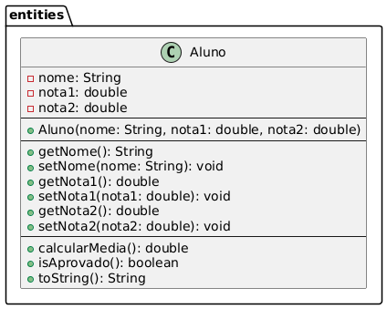

# Student Grade System (Sistema de Gestão de Alunos)


-2B2B2B?style=for-the-badge)


Conforme avanço nos meus estudos sobre **Programação Orientada a Objetos (POO)** em Java, venho desenvolvendo e publicando projetos práticos baseados em situações reais para consolidar os conceitos aprendidos.

Este projeto simula um sistema simples de gestão acadêmica, permitindo o cadastro de múltiplos alunos, cálculo de médias individuais, verificação do status de aprovação e geração de estatísticas da turma, como média geral e aluno com maior desempenho.

Nesta versão, o projeto evoluiu da utilização de **Arrays (Vetores)** para a utilização de **List (`ArrayList`)**, aplicando conceitos da API de Collections do Java e tornando o armazenamento dos objetos mais flexível.


## Demonstração de Uso

Veja o sistema funcionando e interagindo com o usuário diretamente pelo terminal:

> 🎥 **Vídeo da demonstração:** [Assista ao arquivo `demo.mp4`](img/demo.mp4)


## Diagrama da Classe Aluno

A estrutura abaixo representa a modelagem da classe `Aluno`, localizada no pacote `entities`.

Ela demonstra a organização dos atributos privados, construtor, métodos de acesso (`getters` e `setters`) e métodos responsáveis pelas regras de negócio da entidade.




## Conceitos Aplicados


-383838?style=for-the-badge)


Neste projeto, foram aplicados conceitos fundamentais de Java e Programação Orientada a Objetos:

* **List / ArrayList:** Utilização da interface `List` e da implementação `ArrayList` para armazenar múltiplos objetos `Aluno`, permitindo adicionar e percorrer elementos de forma mais flexível.

* **Encapsulamento:** Os atributos da classe `Aluno` são privados (`private`) e possuem acesso controlado através de métodos `getters` e `setters`.

* **Métodos Coesos:** A entidade `Aluno` possui responsabilidades próprias, como o cálculo da média (`calcularMedia`) e a verificação da aprovação (`isAprovado`), mantendo a lógica relacionada ao aluno dentro da própria classe.

* **Sobrescrita de Métodos (`@Override`):** Implementação personalizada do método `toString()` para exibir as informações do aluno de maneira organizada no console.

* **For-each:** Utilização do laço aprimorado do Java para percorrer a lista de alunos de forma mais simples e legível.

* **Organização em Pacotes:** Separação entre a camada de aplicação (`application`) e a entidade do domínio (`entities`).


## Evolução do Projeto

Este projeto passou por uma evolução durante os estudos:

### Versão inicial
- Armazenamento dos alunos utilizando Arrays (`Aluno[]`);
- Percurso utilizando laços tradicionais com índice.

### Versão atual
- Migração para `List<Aluno>`;
- Uso de `ArrayList`;
- Percurso utilizando `for-each`;
- Código mais flexível e próximo das práticas utilizadas em aplicações reais.


## Próximos Passos

Como este repositório acompanha minha jornada de aprendizado em Java, algumas funcionalidades ainda serão implementadas conforme avanço nos estudos:

- Validação de dados de entrada;
- Tratamento de exceções (`Exceptions`);
- Busca e remoção de alunos;
- Atualização de informações cadastradas;
- Persistência dos dados utilizando banco de dados;
- Evolução futura para uma aplicação utilizando Spring Boot.


## Estrutura do Projeto

```text
STUDENT-GRADE-SYSTEM/
├── img/
│   ├── diagram_class_aluno.png  # Diagrama de classe UML
│   └── demo.mp4                 # Gravação do funcionamento no terminal
├── src/
│   ├── application/
│   │   └── Program.java         # Entrada da aplicação e interação via console
│   └── entities/
│       └── Aluno.java           # Entidade com regras de negócio
├── LICENSE
└── README.md                    # Documentação do projeto
